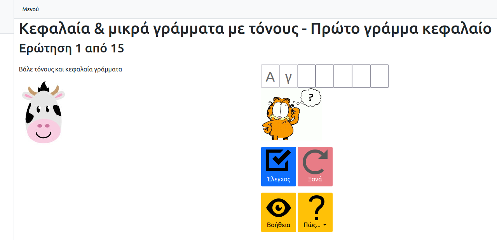
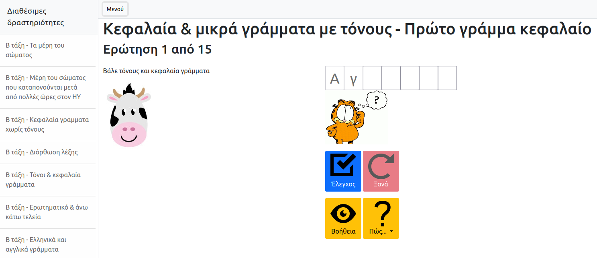

# Alx_write_leters

Λογισμικό για εξοικείωση με την πληκτρολόγηση για μικρές τάξεις Δημοτικού Σχολείου (Α' - Γ' τάξη)

## Τεχνολογία

HTML (bootstrap) + Javascript (jquery, jquery-ui)

## Screenshot

## Video

[Μαθητές της Β' τάξης χρησιμοποιούν το alx_write_letters](https://www.youtube.com/watch?v=my35545DWLI)

## Icons

Τα εικονίδια που χρησιμοποιούνται στην εφαρμογή είναι διαθέσιμα υπό [MIT License](http://opensource.org/licenses/MIT) και μπορείτε να τα κατεβάσετε από [εδώ](https://github.com/iconic/open-iconic).

