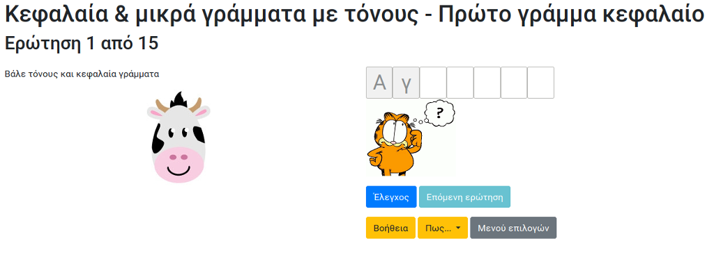

# Alx_write_leters

Λογισμικό για εξοικείωση με την πληκτρολόγηση για μικρές τάξεις Δημοτικού Σχολείου (Α' - Γ' τάξη)

## Τεχνολογία

PHP + Javascript + Bootstrap theme (Bower dependencies)

## Screenshot

## Video

[Μαθητές της Β' τάξης χρησιμοποιούν το alx_write_letters](https://www.youtube.com/watch?v=my35545DWLI)

